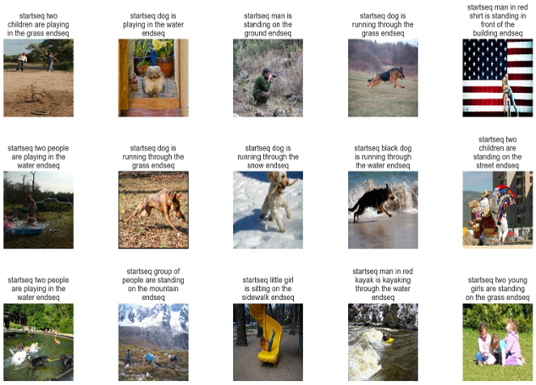
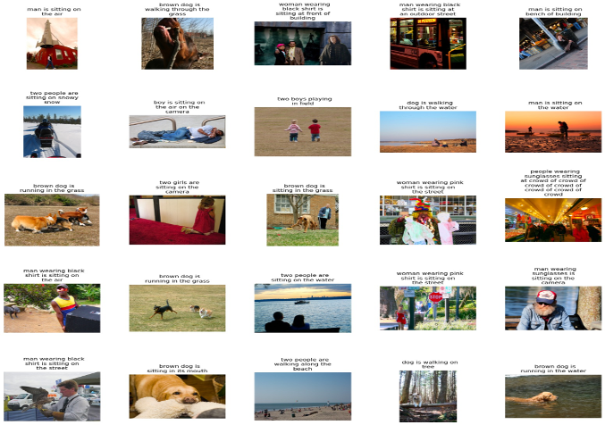

# Image Caption Generation: CNN + LSTM vs ResNet + GRU

This project compares two approaches for image caption generation using deep learning models: CNN + LSTM and ResNet + GRU. The models were trained and evaluated on the Flicker 8K dataset to generate captions for images.

## Authors
- Chaitanya Inamdar
- Abhishek Patil
- Nishith A
- Yashraj Rajput

## Problem Statement

Image recognition plays a critical role in various fields such as:
- Autonomous driving (recognizing vehicles, pedestrians, traffic signals)
- Healthcare (identifying irregularities in X-rays and CT scans)
- Retail (inventory management, tracking customer behavior)

This project tackles the problem of automatically generating captions that describe the contents of images, enabling automated analysis and decision-making based on visual data.

## Data Source

- **Dataset**: Flicker 8K Dataset from Kaggle
- The dataset includes images in `.jpg` format and a corresponding caption file.

## Approach

### Data Preprocessing
1. **Image to Caption Mapping**: Create a mapping of image IDs to their respective captions.
2. **Caption Text Cleaning**: Clean the captions by converting them to lowercase, removing special characters, and adding `startseq` and `endseq` tags.
3. **Tokenization**: Use a tokenizer to convert captions to sequences of integers for model input.
4. **Data Generator**: Create a generator to batch process the data to avoid memory issues.

### Model Architectures

#### 1. CNN + LSTM Model
- **Feature Extraction**: Use a pre-trained DenseNet201 (CNN) model to extract features from images.
- **LSTM**: Use LSTM (Long Short-Term Memory) to generate captions by learning the temporal dependencies in sequences.

#### 2. ResNet + GRU Model
- **Feature Extraction**: Use a pre-trained ResNet50 (CNN) model to extract features from images.
- **GRU**: Use GRU (Gated Recurrent Unit) to generate captions, processing sequential data.

### Training
- Both models were trained with early stopping to prevent overfitting.
- Loss curves for training and validation were compared to evaluate performance.

## Results & Performance

### BLEU Score Comparison
- **CNN + LSTM**: Mean BLEU Score of 75%
- **ResNet + GRU**: Mean BLEU Score of 60%

The CNN + LSTM model performed better in terms of capturing both background and foreground features and generating more context-aware captions compared to the ResNet + GRU model.

### Test Image Results
The models were tested on both the Flicker 8K dataset and real-time images. CNN + LSTM outperformed ResNet + GRU in both cases.

#### CNN + LSTM Results

#### ResNet + GRU Results

## Conclusion

- The **CNN + LSTM** model proved to be more effective than the **ResNet + GRU** model, primarily because LSTM captures the context of captions better than GRU.
- The **CNN + LSTM** model is recommended for image caption generation tasks, with a higher BLEU score and better performance in real-world tests.

## Future Work
- Fine-tuning the models for even better performance.
- Experimenting with different architectures or hybrid models.
- Applying the models to other datasets or real-world applications like autonomous vehicles or healthcare image analysis.

## How to Run the Project

### Prerequisites
- Python 3.x
- TensorFlow / Keras
- tqdm
- Other dependencies listed in `requirements.txt`

### Steps
1. Clone the repository.
2. Download the Flicker 8K dataset from Kaggle.
3. Preprocess the data and extract image features.
4. Train the models using the provided Jupyter notebooks.
5. Evaluate and compare the models.

### Model Training
- To train the CNN + LSTM model, run the `CNN_LSTM_Team_3.ipynb` notebook.
- To train the ResNet + GRU model, run the `RESNET_GRU_Team_3.ipynb` notebook.

## License
This project is licensed under the MIT License.
